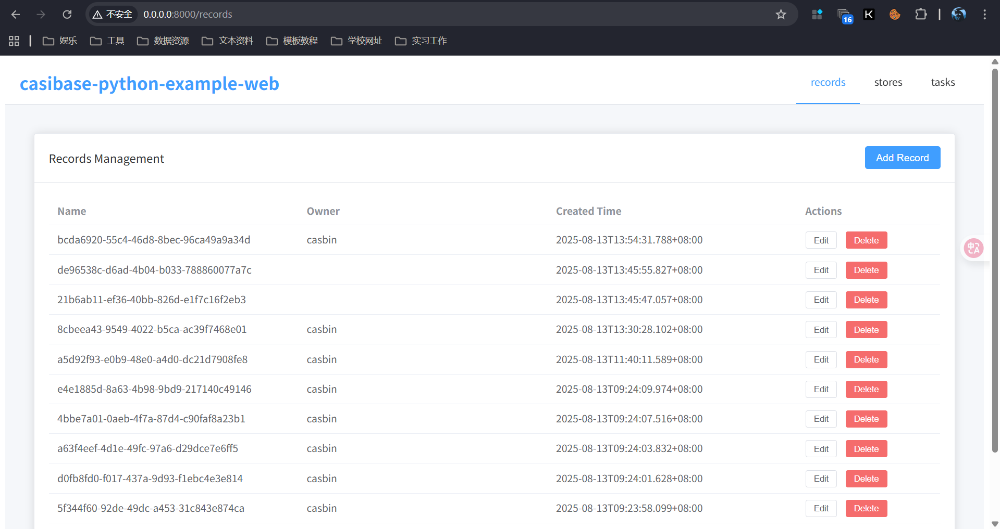
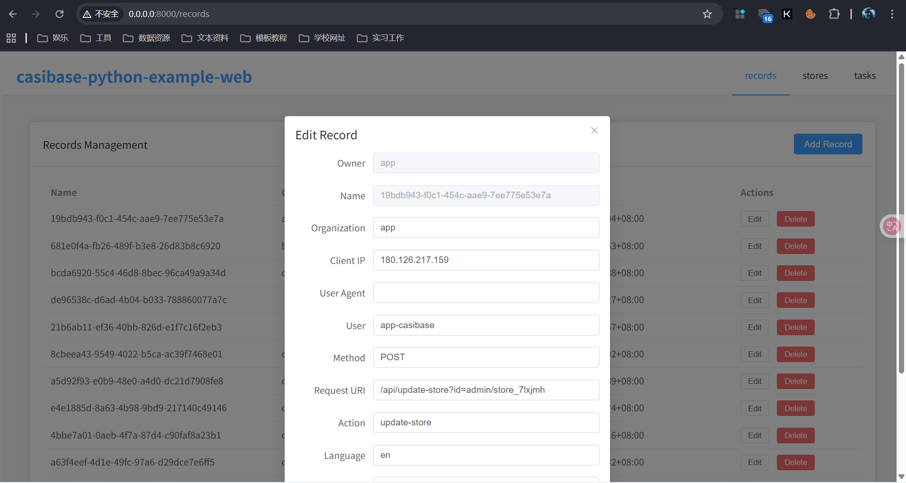

# casibase-python-example

An example of casibase-python-sdk with FastAPI and Vue.js.

## Installation

Example uses Casibase to manage records, stores, and tasks. You need to have a Casibase instance running and configure the credentials properly.

```shell
git clone https://github.com/casibase/casibase-python-example
cd casibase-python-example
```

## Configuration

1. Configure Casibase SDK credentials in `config.py`:

```python
class Config:
    SDK = CasibaseSDK(
        endpoint="https://demo-admin.casibase.com",
        client_id="af6b5aa958822fb9dc33",
        client_secret="8bc3010c1c951c8d876b1f311a901ff8deeb93bc",
        organization_name="casbin",
        application_name="app-casibase",
    )
```

## Running the Application

1. Install Python dependencies:

    ```shell
    python -m venv venv
    source venv/bin/activate  # On Windows: venv\Scripts\activate
    pip install -r requirements.txt
    ```

2. Build the frontend:

    ```shell
    cd web
    npm run build
    ```

3. Install frontend dependencies:

    ```shell
    cd web
    npm install
    ```

4. Start the production server:

    ```shell
    python main.py
    ```

    The application will be served at <http://localhost:8000>

## Demo image




